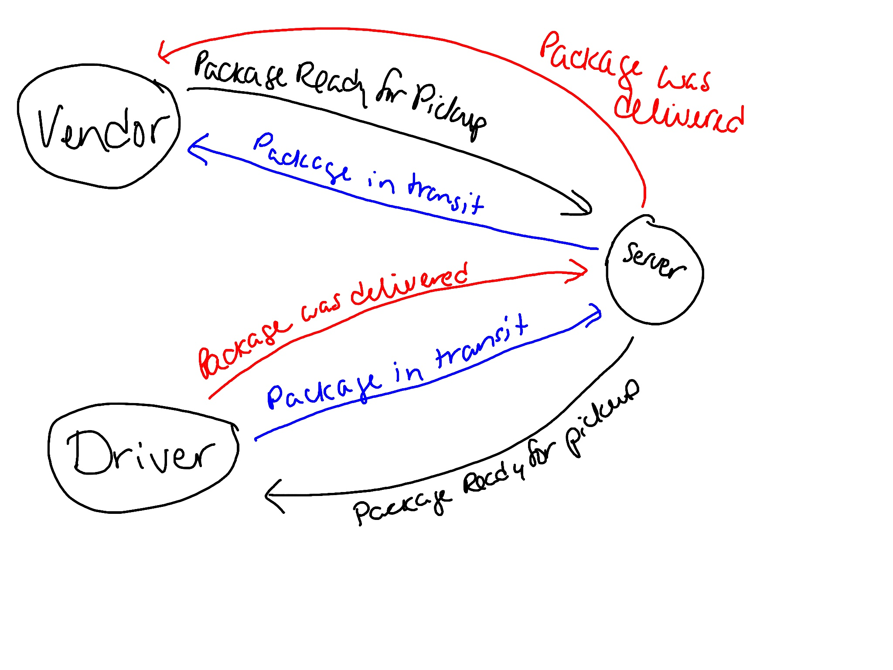

# caps

This project contains a system that emulates a real world supply chain.

### Author: Marlene Rinker

- [Submission PR](https://github.com/marlenerinker-401-advanced-javascript/caps/pull/1)
<!-- - [Tests Report](https://github.com/marlenerinker-401-advanced-javascript/authenticated-api-server/actions)
- [Swagger Hub](https://app.swaggerhub.com/apis/marlene-rinker/auth-api-server/0.1)
- [Heroku deployment](https://auth-api-server-mr401.herokuapp.com/) -->

### Setup

#### `.env` requirements
<!-- PORT= `<port>` (will default to 3000 if you don't specify here)

MONGODB_ATLAS_URI = `<route to mongo>`

SECRET = `<secret-string>`

TOKEN_EXPIRATION = `<when token should expire, for example: 1d>` -->

#### Packages to Install
(see package.json)

dotenv

express

faker

For testing:

jest

#### Running the app
node caps.js 
nodemon caps.js

#### Tests
<!-- - Unit Tests: `npm test` (run from the `__tests__` folder to run all tests, multiple test files are in that folder)

- Assertions Made: -->

#### UML
